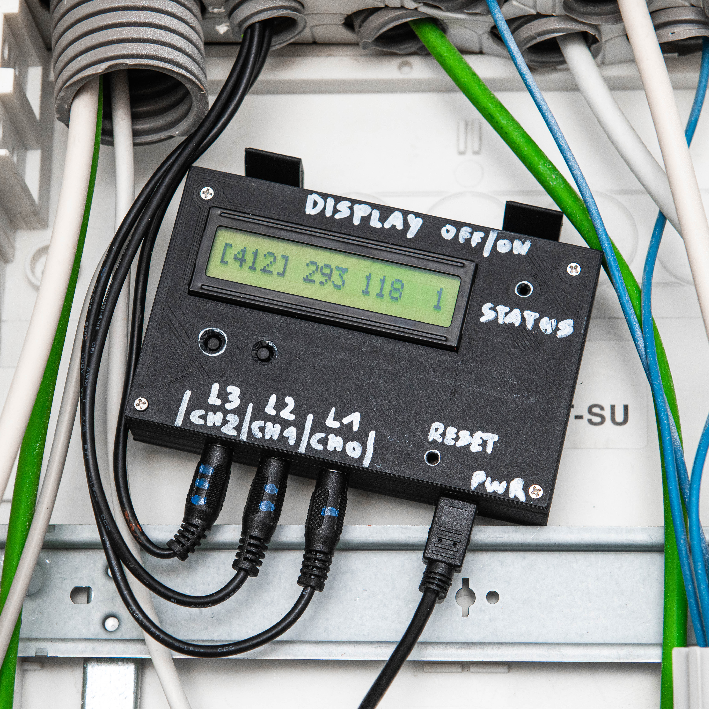
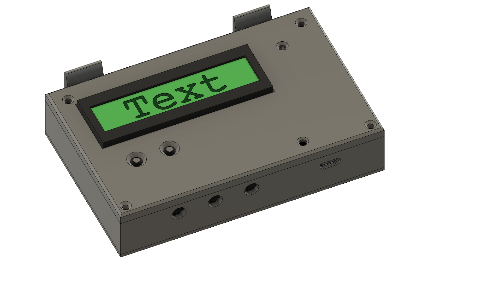
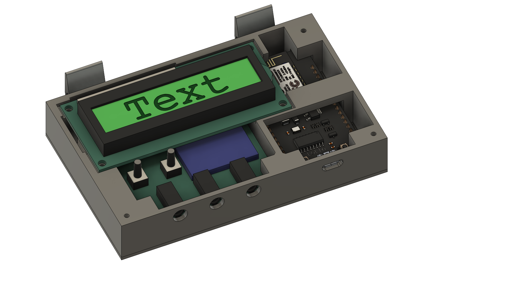
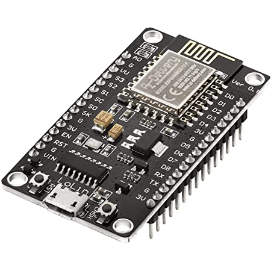
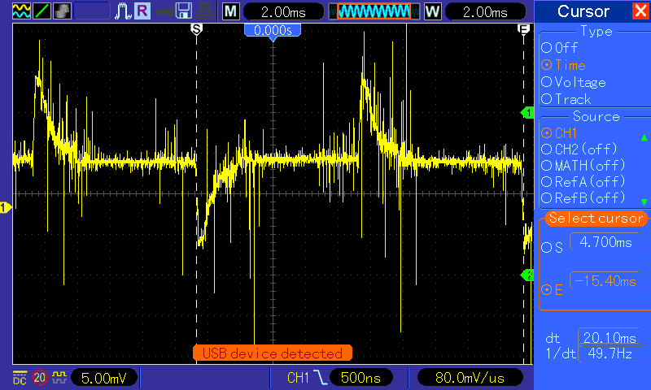
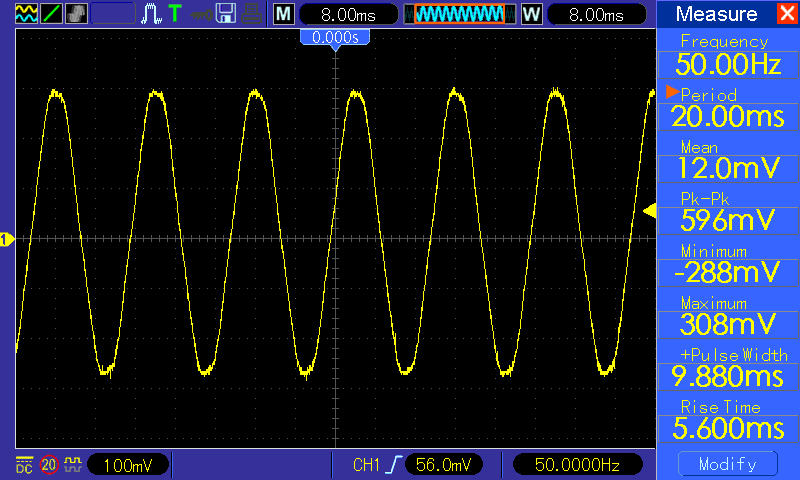

# power-ESP
Simple ESP microcontroller that publishes power consumption to local MQTT. Includes 3D printed case. 

# MQTT NodeMCU









# NodeMCU

- Großes Board V3, 

- ESP8266, 

- CH340G USB-Serial

  

  

# Software

- Arduino (Pro) IDE 2.0
- ESP Boards in Board Manager ([Tutorial](https://randomnerdtutorials.com/installing-esp8266-nodemcu-arduino-ide-2-0/))
- Braucht keine extra Treiber für USB-Serial @ M1 Macbook. Blinky läuft super.


# Projektspezfisch

- PubSubClient Library von Nick O'Leary ([Link](https://pubsubclient.knolleary.net)), in dem Library Manager von Arduino

# PowerMCU

## Features

- [ ] Display mit aktuellen Werten
- [ ] Cooles Case

## ToDo

Base Value reset (TARA)

Base Value im eeprom speichern


## Log

Vergleich [MCC118 RPI Hat](https://www.mccdaq.com/DAQ-HAT/MCC-118.aspx), [ADS1115](https://learn.adafruit.com/adafruit-4-channel-adc-breakouts/overview)
RPI Hat: 12 Bit, 8 CH, 100ks/s
ADS1115: 16 Bit, 4 CH, 860s/s

**[I2C Scanner](https://playground.arduino.cc/Main/sourceblock_1/index.txt?action=sourceblock&num=1) laufen gelassen**

Display: 0x27
ACD: 0x48

Display läuft, aber nur 8 zeichen von 16 (1 Zeile, mit I2C Board)
Vershiedene Modi:

- setup 8/2, cursor L0 L1
  nichts
- setup 16/1, cursor L0x16
  nur ersten 8 ch

Oke nach langem suchen und nichts finden, einfach display auf 5V (VUSB) angeschlossen, dann stimmt das
setup 16/2, L0x8, L1x8
ENDLICH

```c
LiquidCrystal_I2C lcd(0x27, 8, 2); // I2C address 0x27, 8 column and 2 rows
void printlcd(String s){
    lcd.setCursor(0,0);
    lcd.print(s.substring(0,8));
    lcd.setCursor(0,1);
    lcd.print(s.substring(8,16));
}
```

**Display funktioniert endlich.**

Upload Speed geiler machen. Wenn errors auftreten, hier ändern.


ADC Sensor Basics mit der [Adafruit Library](https://learn.adafruit.com/adafruit-4-channel-adc-breakouts/arduino-code)

Berechnung der Spannung aus den Werten: einfache MAP Funktion

**Adafrut lib setzt ein delay** rein. limit 100 Samples pro sek. Andere Lib verwenden.

https://thecavepearlproject.org/2020/05/21/using-the-ads1115-in-continuous-mode-for-burst-sampling/

Lib geladen, installiert [Test sketch](https://github.com/terryjmyers/ADS1115-Lite/blob/master/examples/ADS1115_lite/ADS1115_lite.ino) rennt

Jetzt den Burst Mode: läuft auch

Test mit Klemme: Ikea 7W Lampe aufgebaut, kommt nichts an.
Stromzange sagt 0.05A wenns läuft. Auf 220V sind das 11 W

Das will ich auf der Klemme haben. Und am Oszi.

Alles rauscht extrem, ich bekomm kaum ein signal raus. ICh sollt einfach werte samplen über ne sekunde und dann berechnen, scheiß doch drauf. is keine Wissenschaft, sollte nur halbwegs passen.

Hier [einfaches Tutorial](https://www.poweruc.pl/blogs/news/non-invasive-sensor-yhdc-sct013-000-ct-used-with-arduino-sct-013) mit den selben sensoren. Trotzdem bessere lib nehmen statt adafruit.

Glühbirne reicht net. ich brauch mehr last. Habe den Föhn genommen

Glühbirne ~7W. Extrem viel rauschen. War ne LED, vielleicht liegts daran?



Föhn auf Vollgas ~2200W. Damit kann man arbeiten 😜 




1. in mv umrechnen
2. hochklappen (minus eintfernen)
3. average rechnen
4. amps berechnen
5. watt berechnen


Okay kalibrierung:

|                   | Stromzange       | Multimeter, direkt | PowerMCU |
| ----------------- | ---------------- | ------------------ | -------- |
| Lampe             | 0.048 (2A range) | 0.053              | 0.027    |
| Fühn Luft1, Heiz0 | 0.780 (2A range) | 0.806              | 0.704    |
| Föhn Luft2, Heiz0 | 1.364            | 1.394              | 1.195    |
| F L1, H1          | 2.28             | 2.353              | 2.079    |
| F L2, H1          | 4.13             | 4.25               | 3.660    |
| F L1, H2          | 4.08             | 4.21               | 3.627    |
| F L2, H2          | 7.96             | 8.16               | 5.054    |
|                   |                  |                    |          |
|                   |                  |                    |          |

Ich bekomm Multimeter und powerMCU einfach nicht auf die selben ergebnisse. Vielleicht weil die Kurven abgeschnitten sind und ich nicht genau weiß wo die Mitte der Kurve ist? Ist vielleicht die Berechnung von den Messgeräten auf einen schönen Sinus ausgelegt, den ich ja nicht hab?

Naja habs dabei belassen dass ich über das array Mittle und jeden wert berücksichtige. Das ist bei kleinen Lasten recht gut dabei, aber bei großen Lasten hab ich ggü dem Multimeter teilweise 50% abweichung. Ist aber der selbe rechenweg wie beim Raspberry, also lass ich das mal so.


# powerMCUv2 (TODO)

## Was soll es können?

- WiFi Verbindung (config auf SD Karte)
- Display für Statusanzeige
- Strommessung aller 3 Phasen
- Schickt Daten per MQTT
- Schickt Daten direkt an MySQL DB
- Offset austarieren
- Fallback Battery
- Wide Range DC Power In
- Log auf SD Card

## Hardware

- Microcontroller
  - ESP32
  - CH340G USB Serial Converter
  - Buck Converter (mini360)
- Micro SD Card Breakout
- Display
  - 1x20 Character Display
  - PCF8457 Display Driver
- ADS1115 ADC
- 3.5mm Klinke Input x3
- SCT013 20A/1V Strommmesser
- DIN Rail PSU
